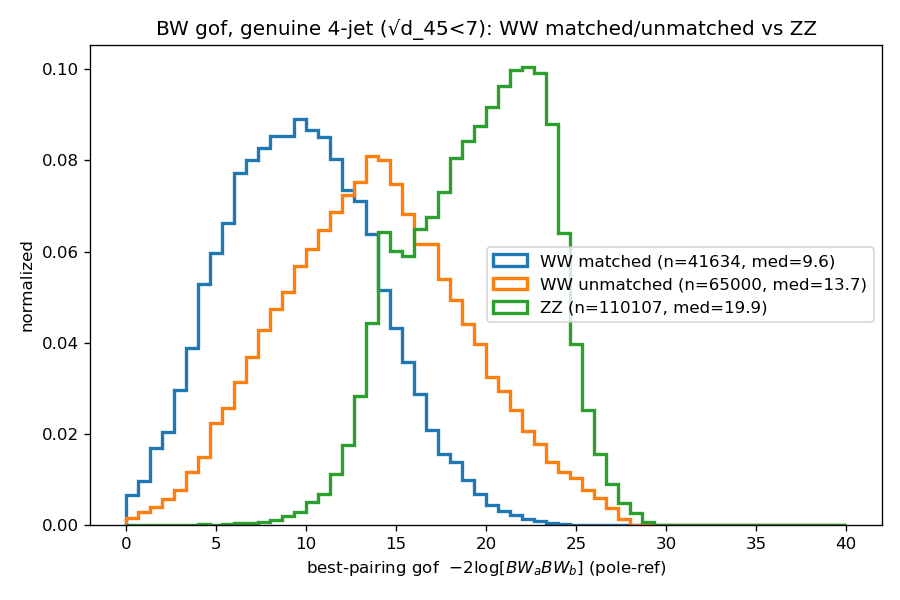

# Breit-Wigner jet → W pairing (standalone)

A small, self-contained tool that decides, for a fully-hadronic **WW → 4 jets**
event, **which two jets came from the first W and which two from the second** —
using only the Breit-Wigner compatibility of the two di-jet masses with the W
resonance. **No kinematic fit, no Minuit** — pure arithmetic, microseconds/event.

It also works as a **WW-vs-background discriminant** (e.g. ZZ → 4 jets): the
best-pairing goodness-of-fit is larger for ZZ (di-jet masses near the Z, not the W).

## The idea in one line

The 4 jets split into 2+2 in **three ways**. For each split, score the two di-jet
masses with a Breit-Wigner at the W pole; the most W-like split wins.
```
gof[k]  = -2 * ( log BW(m_a) + log BW(m_b) )   (pole-referenced, so >= 0; lower = more W-like)
prob[k] = BW(m_a)·BW(m_b) / sum_j (...)        (posterior over the 3 splits, sums to 1)
pairing = argmin_k gof[k]
```
`gof` of the winner is also the WW-vs-ZZ discriminant.

> **Every file is documented at the top** (headers / docstrings) — read those for
> the details and the physics choices (e.g. why a bare BW with no normalization
> table). This README is just how to run it.

## Files

| file | what it is |
|------|------------|
| `BWPairing.h`            | the tool: `bwPairing(jet1..jet4) -> {pairing, gof[3], prob[3], masses}` |
| `JetQuarkMatching.h`     | gen-truth jet↔quark matching (no BW — only to *measure* the efficiency) |
| `treemaker_bw_pairing.py`| the **single** processing step (signal → cluster 4 jets → cut → pair → truth) |
| `analyze_bw_pairing.py`  | pairing efficiency + WW-vs-ZZ gof plot |
| `run.sh`                 | runs WW, ZZ, then the analysis |

## How to run

From the **repository root**, in a key4hep / FCCAnalyses environment that provides
the `fccanalysis` command:

```bash
source <your FCCAnalyses setup.sh>
bash bw_pairing_standalone/run.sh
```
or step by step:
```bash
BW_BOSON=W BW_SAMPLE=p8_ee_WW_ecm160 fccanalysis run bw_pairing_standalone/treemaker_bw_pairing.py
BW_BOSON=Z BW_SAMPLE=p8_ee_ZZ_ecm160 fccanalysis run bw_pairing_standalone/treemaker_bw_pairing.py
python3 bw_pairing_standalone/analyze_bw_pairing.py
```
Outputs: ntuples in `outputs/bw_pairing/{W,Z}/`, plots in `bw_pairing_plots/`.

Options (env vars): `BW_SAMPLE`, `BW_BOSON` (`W`/`Z`), `BW_SQRTD45_MAX` (genuine-
4-jet cut, default `7.0` GeV; `0` disables), `BW_FRACTION` (default `0.001`),
`BW_OUTDIR`.

## What you should reproduce

`analyze_bw_pairing.py` should print a **pairing efficiency** around
```
all events       ~ 0.70
matched (dR<0.1) ~ 0.91     <- where the 4 jets cleanly match the 4 quarks
unmatched        ~ 0.63
```
and produce this **WW-vs-ZZ gof** plot — three separated populations (WW-matched
lowest, WW-unmatched middle, ZZ highest), WW-matched-vs-ZZ AUC ≈ 0.95:



(Reference: `p8_ee_{WW,ZZ}_ecm160`, genuine-4-jet cut `sqrt(d_45) < 7`. Your
medians should match to within statistics.)

## Calling the tool directly (C++)

```cpp
#include "BWPairing.h"
using namespace FCCAnalyses::WWFunctions;          // jet1..jet4 are TLorentzVector
BWPairingResult r = bwPairing(jet1, jet2, jet3, jet4);
int   best = r.pairing;     // 0,1,2  -> chosen 2+2 split
float gof  = r.gof_best;    // discriminant (low = W-like)
float prob = r.prob_best;   // posterior of the chosen split (see BWPairing.h on calibration)
// convention: 0:(j1 j2)(j3 j4)  1:(j1 j3)(j2 j4)  2:(j1 j4)(j2 j3)
```
